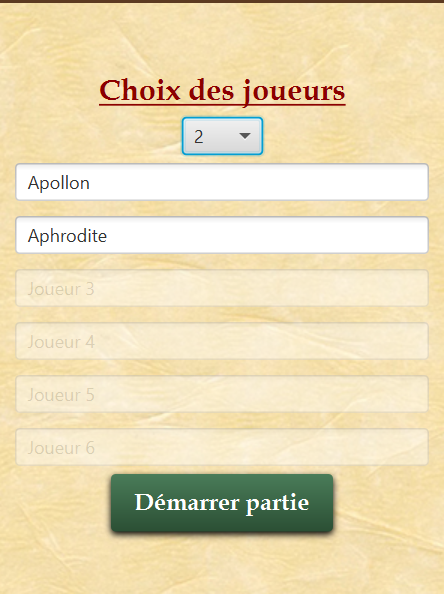
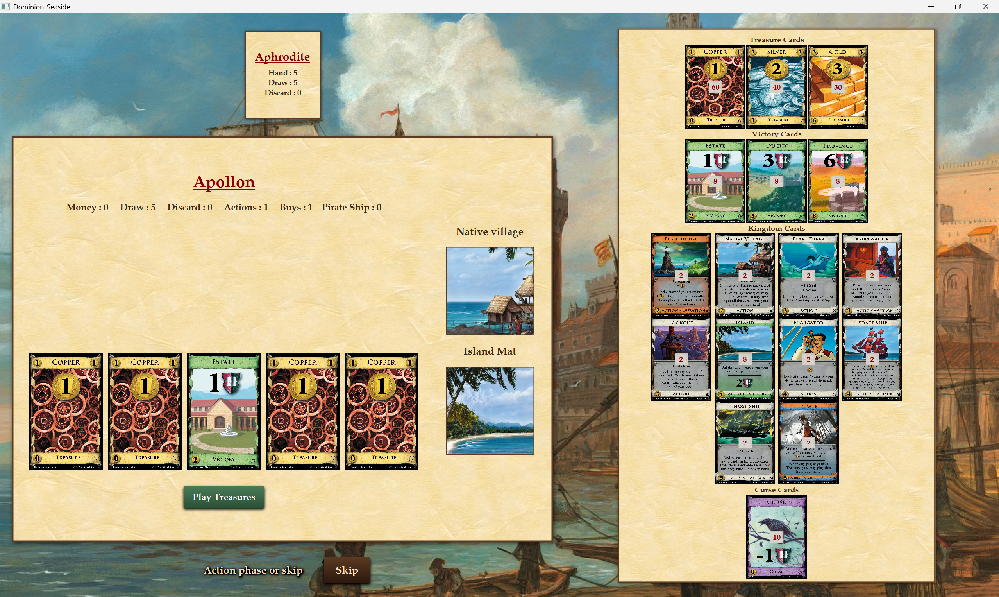

# Dominion Seaside - Moteur de Jeu & Client Riche JavaFX ⚓


Implémentation complète en Java de l'extension *Seaside* du célèbre jeu de deck-building **Dominion**. Le projet modélise fidèlement les mécaniques complexes du jeu de plateau (cartes à effet différé, attaques, interactions multi-joueurs) et intègre une **architecture distribuée client-serveur** communiquant par WebSockets.

Ce dépôt illustre la conception d'un monorepo professionnel : la transition d'un **moteur métier robuste** (Backend) vers la connexion avec une **interface utilisateur riche et réactive** (Frontend JavaFX), avec un fort accent sur les design patterns et les tests unitaires.

---

## 📸 Aperçu




---

## 🌟 Fonctionnalités Clés

* **Règles officielles Dominion Seaside :**
  * Gestion complète du cycle de vie des tours (Phase d'Action, d'Achat, et de *Cleanup*).
  * Prise en charge des cartes spécifiques de l'extension : *Duration* (effets persistants au tour suivant), *Reaction*, et *Attack*.
  * Implémentation des plateaux individuels persistants (*Island Mat*, *Native Village Mat*).
* **Architecture Réseau & Client Lourd :**
  * **Moteur métier et Serveur (Backend) :** Logique de jeu centralisée et serveur WebSocket (Tyrus) gérant les requêtes asynchrones des joueurs.
  * **Interface JavaFX (Frontend) :** Plateau de jeu dynamique avec mise à jour en temps réel des actions des joueurs, du deck et de la défausse.
* **Programmation Réactive :** Synchronisation de l'affichage via le pattern Observer, l'écoute des `ChangeListeners` et les `Bindings` natifs de JavaFX.

---

## 🧠 Architecture Logicielle & Design Patterns

Le code source a été restructuré pour maximiser la maintenabilité et l'extensibilité du jeu :

1. **Découplage Client/Serveur :**
   * Séparation physique du code en deux modules (`dominion-backend` et `dominion-javafx`).
2. **Design Patterns Appliqués :**
   * **MVC (Modèle-Vue-Contrôleur) :** Séparation stricte entre l'état de la partie (`Game`, `Player`, `Card`) et l'affichage UI.
   * **Façade :** Utilisation d'interfaces dédiées pour permettre au client de manipuler le moteur de jeu (considéré comme une boîte noire) sans en exposer la complexité.
   * **Polymorphisme & Abstraction :** Création de classes abstraites (ex: `AttackCard`) centralisant la logique de résolution d'attaque et de vérification d'immunité (`Lighthouse`), réduisant drastiquement la duplication de code.
3. **Qualité & Tests :** Validation en continu de la logique métier (effets des cartes, comptage des points de victoire, conditions de fin de partie) via JUnit 5.

---

## 🏗 Architecture du Projet

```text
Dominion-Project/
├── .gitignore
├── README.md
├── docs/
│   └── diagramme_classes_squelette.png # Modélisation logicielle UML
├── dominion-backend/                   # Phase 1 : Moteur métier & Serveur WebSocket
│   ├── src/
│   └── pom.xml
└── dominion-javafx/                    # Phase 2 : Interface riche client lourd
    ├── captures/                       # Captures d'écran
    │   ├── Interface_choix_joueurs.png
    │   └── Interface_vue_joueur.png
    ├── src/
    └── pom.xml
```

---

## ⚙️ Installation et Exécution

### Prérequis
* **JDK 21** ou supérieur.
* Un IDE Java (IntelliJ IDEA, Eclipse, VSCode) **OU** Maven installé globalement sur votre machine.

### 1. Cloner le dépôt
```bash
git clone [https://github.com/Matis-Chedru/Dominion-Project.git](https://github.com/Matis-Chedru/Dominion-Project.git)
```

### 2. Exécution via IDE (Recommandée)
1. Ouvrez le dossier `dominion-backend` comme un projet Maven dans votre IDE.
2. Laissez les dépendances se télécharger, puis exécutez la classe principale `fr.umontpellier.iut.dominion.AppDominion`.
3. Ouvrez le dossier `dominion-javafx` dans une autre fenêtre de votre IDE et lancez la classe principale de l'interface.

### 3. Exécution via Terminal (Alternative)
*Nécessite que la commande `mvn` soit reconnue dans votre variable d'environnement PATH.*

**Démarrer le Backend :**
```bash
cd dominion-backend
mvn clean compile exec:java -Dexec.mainClass="fr.umontpellier.iut.dominion.AppDominion"
```

**Démarrer le Frontend JavaFX :**
```bash
cd ../dominion-javafx
mvn clean compile javafx:run
```

## 👥 Auteurs & Contexte Académique

Projet universitaire réalisé en binôme dans le cadre du **BUT Informatique (parcours RACDV)** à l'**IUT de Montpellier**.

* **Matis CHEDRU** : Modélisation du contrôleur de partie et du cycle de vie des tours (`cleanup`, `playTurn`, interaction avec le deck), refactoring structurel des mécaniques d'attaque (création de l'abstraction `AttackCard`), implémentation de cartes complexes (`Blockade`, `Corsair`, `GhostShip`, `Embargo`) et validation de la logique métier via l'écriture des tests unitaires (`CardsTestEtudiants`).
* **Tiphaine GREZE** : Modélisation des actions complexes et des cartes à effet différé (*Duration*, *Reaction*), gestion de la pioche asynchrone et des malus adverses, implémentation d'une large majorité des cartes du set Seaside (`Tactician`, `PirateShip`, `Island`, `Native Village`, `Wharf`), et optimisation globale des méthodes métiers du joueur.